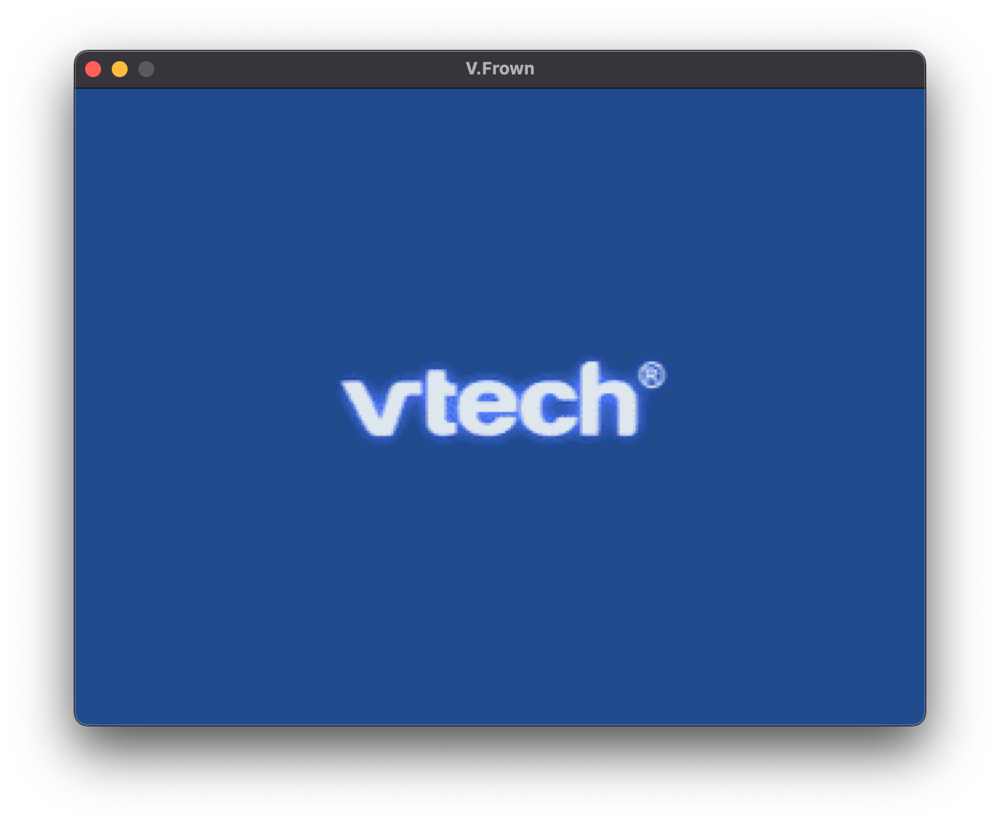
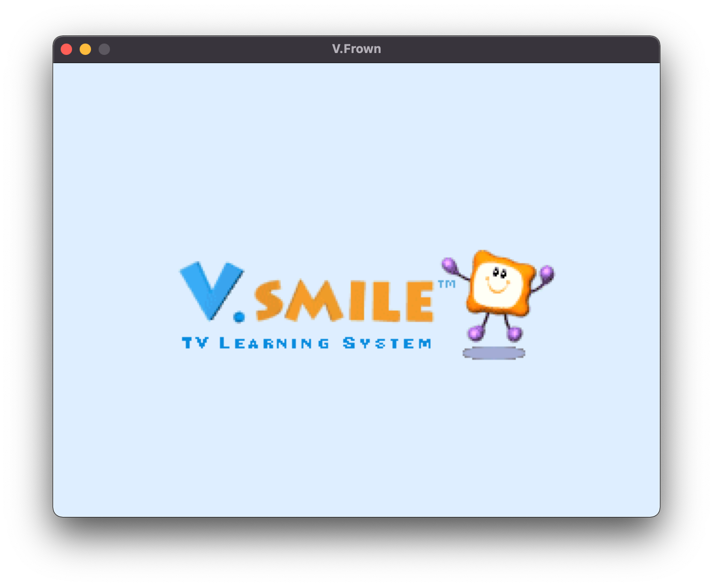
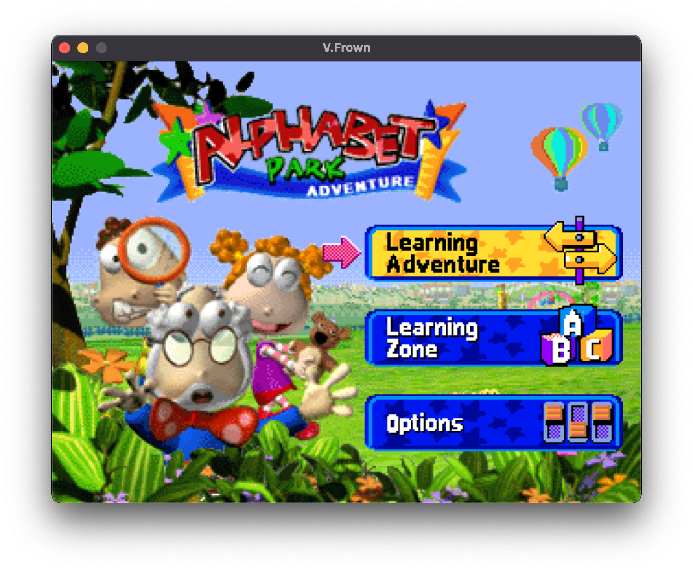
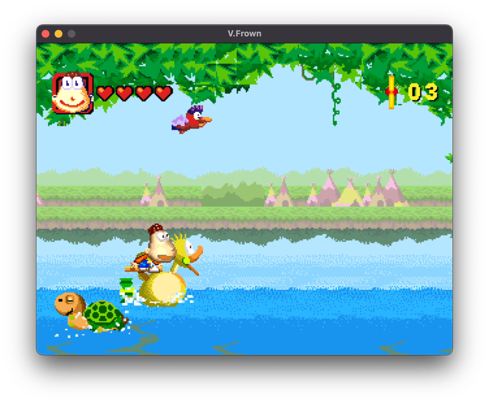
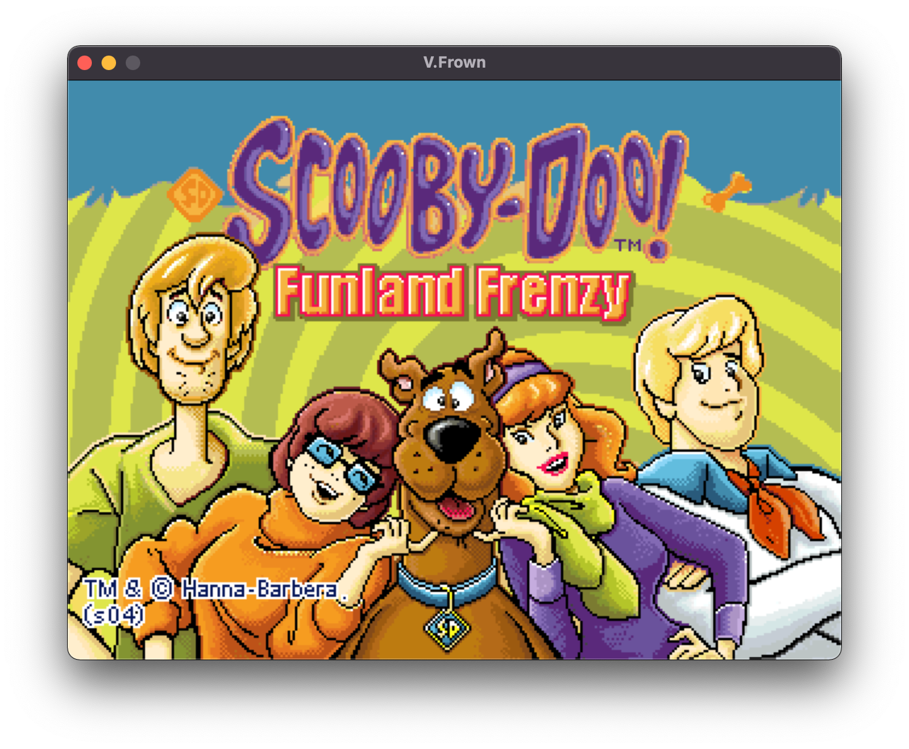
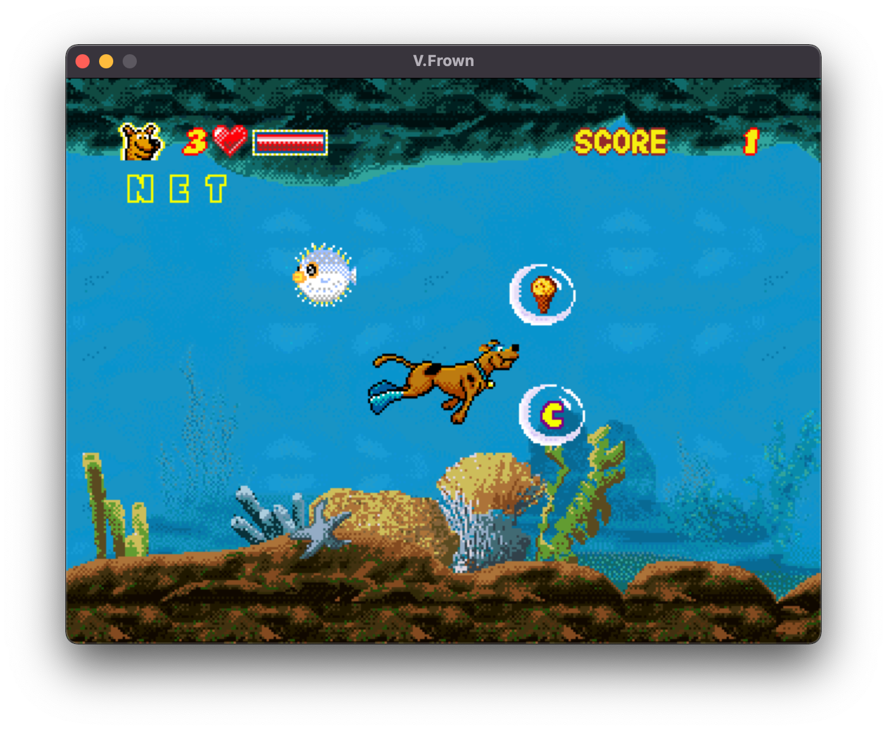

# V.Frown
 An experimental emulator for the V.Smile

 

**NOTE: this emulator is still a work in progress.**

## Building
#### Dependencies
You will need SDL 2.x and Make installed to compile this project
#### Building and Running
Create a folder in the same location as VFrown named `BIOS` and insert a copy of your BIOS called `bios.bin`. You may also specify where the BIOS is located using `-bios` followed by the path to the image. While this step isn't required by VFrown, not all games can run properly (or at all) without a BIOS image.


Run the following commands:
```
cd <path/to/project>
Make
./VFrown <path/to/game>
```
This original version of the emulator was programmed on MacOS.
Appologies to those who are struggling to run this on other platforms

## Controls
```
Arrow keys: directional movement
Space: Enter/OK
A: Exit
S: Help
D: Learning Zone
Z: Red
X: Yellow
C: Blue
V: Green

Backquote/~: toggle fullscreen
1: toggle layer 1
2: toggle layer 2
3: toggle sprites
4: pause/play
5: frame advance
6: sprite outlines
7: sprite flip visualization
8: SPU channel oscilloscope view
0: reset
```

## Examples







## TODO / Roadmap
Currently...
- Improve Sound (Top priority)
- Improve accuracy and get more games booting (Top priority)

Later on...
- Add Savestates
- Add support for more controllers
- Add a graphical interface
  - Add Remappable buttons
  - Add a TAS interface
  - Memory viewer, editor, and cheat manager
  - ...and more...
